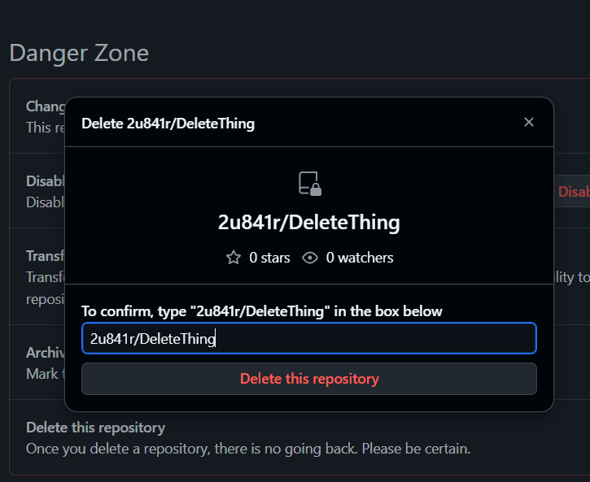
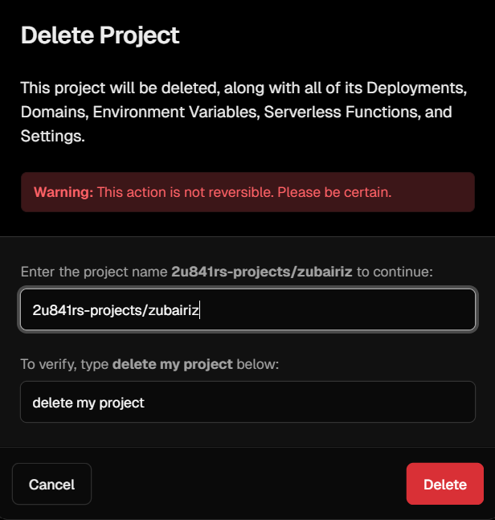
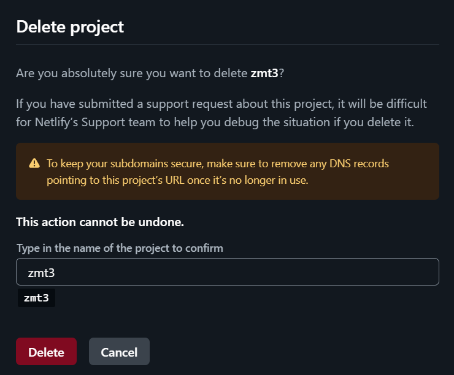
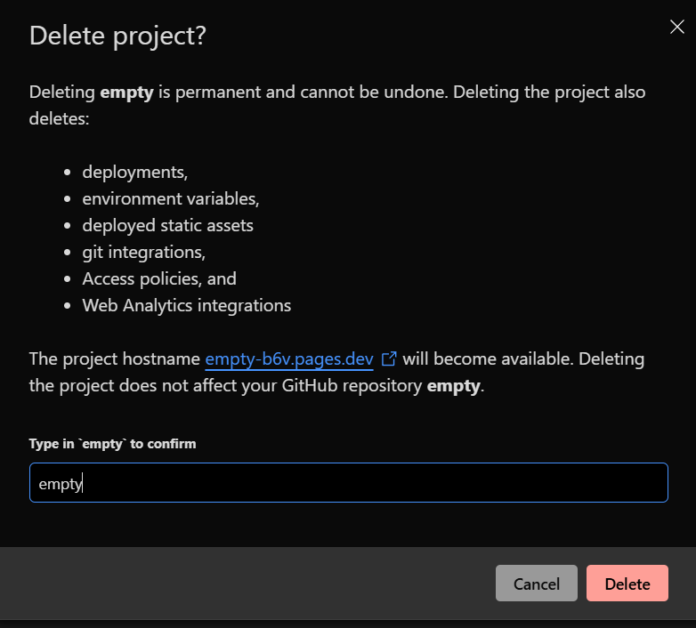

<table>
  <tbody>
    <tr>
      <td></td>
      <td><h1>DeleteThing</h1></td>
    </tr>
  </tbody>
</table>

**A browser extension that eliminates the tedious deletion confirmation process across major cloud platforms.**

[](https://dub.sh/deletething)
[](https://github.com/2u841r/DeleteThing/releases)
[](https://github.com/2u841r/DeleteThing/blob/main/LICENSE)

### "Life's too short to manually type / copy paste project names in deletion confirmations."


## 🤔 The Problem

We've all been there. You want to delete a project, repository, or deployment, and you're faced with:
<!-- - **Vercel**: Type the project name + "delete my project"
- **Netlify**: Type the exact project name 
- **Cloudflare**: Type the project/worker name again
- **GitHub**: Click through 3 confirmation steps + type the full repository name -->
<p align="center">
  
  
</p>
<p align="center">
  
  
</p>


It's 2024, and we're still manually typing- or at least copy-pasting `my-super-long-project-name-with-hyphens` just to delete something. This repetitive, error-prone process wastes your time.

## 💡 The Solution

**DeleteThing** automates these annoying deletion confirmations by:

- ✅ **Auto-filling** project/repository names in confirmation fields
- ✅ **Auto-clicking** through multi-step confirmation dialogs  
- ✅ **Smart detection** of project names from URLs and page content
- ✅ **Zero configuration** - works immediately after installation

## 🚀 Supported Platforms

| Platform | Features | Status |
|----------|----------|--------|
| **Vercel** | Auto-fills project name + "delete my project" | ✅ |
| **Netlify** | Auto-fills project name | ✅ |
| **Cloudflare Pages** | Auto-fills project name | ✅ |
| **Cloudflare Workers** | Auto-fills worker name | ✅ |
| **GitHub** | 3-step automation + repository name | ✅ |

[TODO] AWS, Convex, Deno Deploy

## 🎯 How It Works

### GitHub (3-Step Process)
1. **You click**: "Delete this repository" 
2. **Extension auto-clicks**: "I want to delete this repository"
3. **Extension auto-clicks**: "I have read and understand these effects"  
4. **Extension auto-fills**: Repository name (e.g., `username/repo-name`)

All steps complete within **1 second** of your initial click.

### Other Platforms
1. **You click**: Delete button to open modal
2. **Extension auto-fills**: All required confirmation fields
3. **You click**: Final delete button

## 📦 Installation

### Option 1: Chrome Web Store (Recommended)
[Download from Chrome Web Store](https://dub.sh/deletething)

### Option 2: Local Development
1. Clone this repository:
   ```bash
   git clone https://github.com/2u841r/DeleteThing.git


1. Open Chrome and navigate to chrome://extensions
2. Enable Developer Mode (top-right toggle)
3. Click Load Unpacked and select the repo folder

## 🔧 Usage

1. Install the extension
2. Navigate to any supported platform's settings/deletion page
3. Click the delete button as usual
4. Watch the magic happen ✨
No configuration needed - the extension automatically detects the platform and handles the rest.

## 🛡️ Privacy & Security

- No data collection - everything runs locally in your browser
- No external requests - only interacts with the current page
- Open source - full transparency of what the code does
- Minimal permissions - only accesses supported domains

## 📋 Version History

v1.1 - GitHub Support

- ✅ Added GitHub repository deletion automation
- ✅ 3-step confirmation process handling
- ✅ Smart repository name detection
- ✅ Sub-1-second completion time

v1.0 - Initial Release

- ✅ Vercel project deletion
- ✅ Netlify site deletion
- ✅ Cloudflare Pages deletion
- ✅ Cloudflare Workers deletion

## 🤝 Contributing

Found a cloud platform with annoying deletion confirmations? We'd love your help!

Adding New Platforms

1. Fork the repository
2. Add platform configuration to content.js
3. Test thoroughly
4. Submit a pull request

Reporting Issues

- Create an issue for bugs or feature requests
- Include platform, browser version, and steps to reproduce

## 🎨 Credits

- Logo design by [Openmoji](https://github.com/hfg-gmuend/openmoji)
- Theo Browne t3․gg, CEO [T3.Chat](https://t3.chat) for Namething. 
- Inspired by developer frustration worldwide 😅

### Made with ❤️ by developers, for developers who are tired of typing the same thing twice.

## 📊 Stats / Star History
<a href="https://www.star-history.com/#2u841r/DeleteThing&Date">
 <picture>
   <source media="(prefers-color-scheme: dark)" srcset="https://api.star-history.com/svg?repos=2u841r/DeleteThing&type=Date&theme=dark" />
   <source media="(prefers-color-scheme: light)" srcset="https://api.star-history.com/svg?repos=2u841r/DeleteThing&type=Date" />
   
 </picture>
</a>


